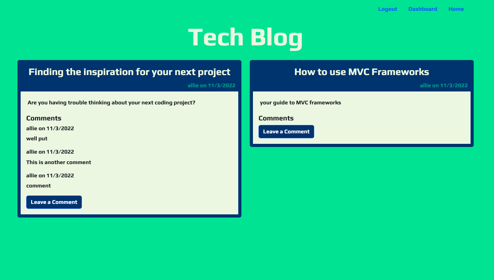
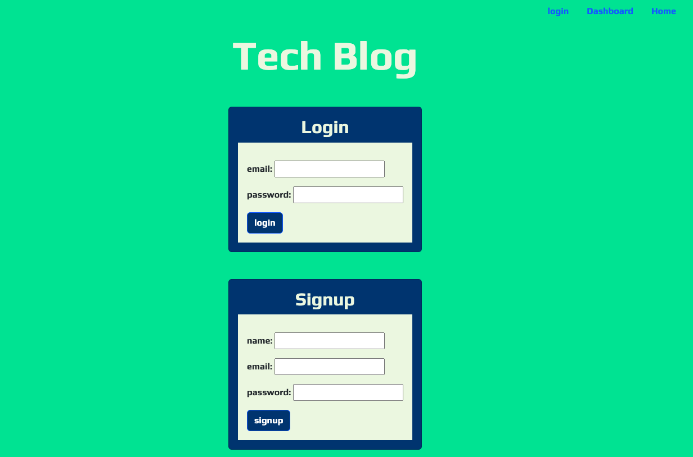
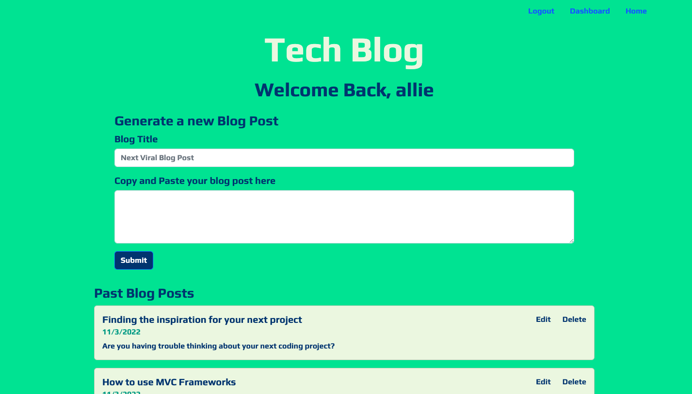
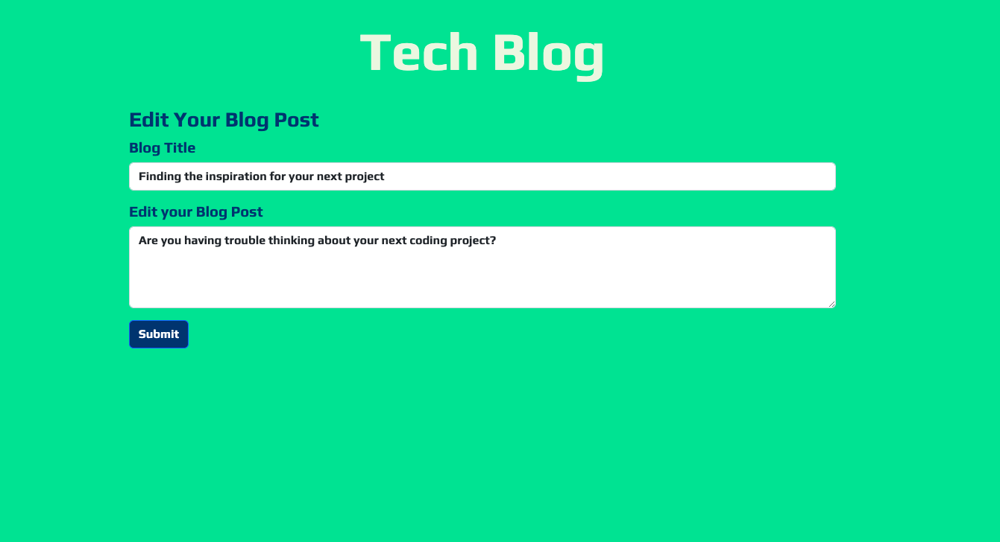

# Tech-Blog-

## Description 

This project is a full stack application build using express.js, user authentification, sequelize, and handlebars.js. While making this project, I learned how to impliment user authentification and strengthened my knowledge of MVC frameworks through the build of this project. My favorite part of making this project was designing the post partial on handlebars and using that partial on the homepage. Using elements from bootstrap gave the application a finished look. The most challenging aspect of this project were the various bugs that would appear while building. The routes are not as organized into different files as they could be which taught me to keep the routes more organized in the future so that bugs could be easier to track. 

## Installation 

In order to access this application, go to the link below to where the web
application is deployed to. 

https://alejandra-quintero-tech-blog.herokuapp.com/

## Usage 

The app will open on the homepage which features all of the blogposts made by all users. 

This application features user authentification and bcrypt which allows a user to securily create an account when they navigate to the login page. If a user is not logged in, the user will be prompted to the log in page when the user clicks on the dashboard link.

Once the user logs in, they will be redirected to their dashboard. On their dashboard, the user is able create a new blog post. When the blogpost is made. It will show up on thier dashboard where they are able to delete a previous blog post or they can edit the blogpost.

If the user chooses to edit thier blogpost, they will directed to another edit page. 

## Credits 

I recieved help from tutor Megan Meyers who helped me debug the edit feature of the application.  

Color Scheme came from: 

https://visme.co/blog/website-color-schemes/

I used bootstrap 5.2 for the different components such as the cards, the navigation, and the display at the top of the webpage. 

I used Google Fonts for the font displayed. 

## License 

MIT License

Copyright (c) [2022] [AlejandraQuintero]

Permission is hereby granted, free of charge, to any person obtaining a copy
of this software and associated documentation files (the "Software"), to deal
in the Software without restriction, including without limitation the rights
to use, copy, modify, merge, publish, distribute, sublicense, and/or sell
copies of the Software, and to permit persons to whom the Software is
furnished to do so, subject to the following conditions:

The above copyright notice and this permission notice shall be included in all
copies or substantial portions of the Software.

THE SOFTWARE IS PROVIDED "AS IS", WITHOUT WARRANTY OF ANY KIND, EXPRESS OR
IMPLIED, INCLUDING BUT NOT LIMITED TO THE WARRANTIES OF MERCHANTABILITY,
FITNESS FOR A PARTICULAR PURPOSE AND NONINFRINGEMENT. IN NO EVENT SHALL THE
AUTHORS OR COPYRIGHT HOLDERS BE LIABLE FOR ANY CLAIM, DAMAGES OR OTHER
LIABILITY, WHETHER IN AN ACTION OF CONTRACT, TORT OR OTHERWISE, ARISING FROM,
OUT OF OR IN CONNECTION WITH THE SOFTWARE OR THE USE OR OTHER DEALINGS IN THE
SOFTWARE.

## Features 

The application uses bcrypt and auser authentification and sequelize to generate the models for the users, the posts, and the comments. 

